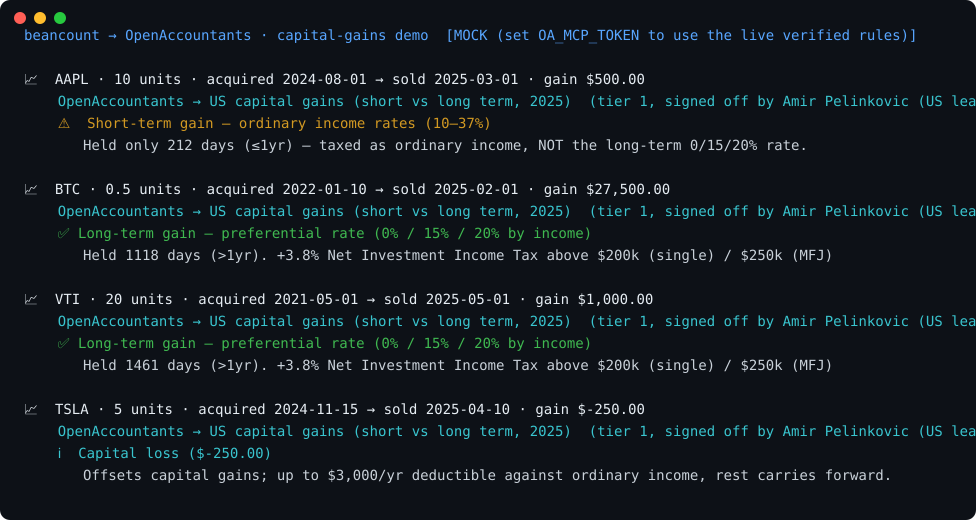

# Beancount → OpenAccountants: illustrative capital gains

Read a strict USD investment-ledger subset, match lots by account and commodity
using FIFO, and calculate exact proceeds less basis. The example classifies
ordinary purchased investment property using a calendar holding period.
Bundled rules have no professional sign-off, and no tax rate or liability is
calculated.



## Run it

Python 3.10 or later and the standard library are sufficient.

```bash
python pipeline.py
python pipeline.py samples/portfolio.beancount
python -m unittest discover -s tests -v
python make_svg.py
```

The default command and SVG generator use bundled examples. Invalid ledger
input returns exit code 2 before any gains are reported. An unsupported rule
contract or unresolved holding period also returns 2 while retaining the known
gain calculation. A valid ledger with purchases but no disposals says that no
gain classification was performed.

## Accepted ledger subset

This parser does not implement Beancount's full grammar or replace its ledger
validator. It accepts only the following investment trades:

- Dated `open` directives for `Assets:` and `Income:` accounts, before first use.
  Account components start with an ASCII capital letter and then contain ASCII
  letters, digits, underscores or hyphens.
- Chronological `YYYY-MM-DD * "Narration"` transaction headers, with an optional
  quoted payee before the narration. Blank lines and whole-line `;` comments
  are allowed.
- One investment posting and one explicit USD cash posting per trade. Purchases
  require a positive quantity and `{unit_cost USD}`. Sales require a negative
  quantity, `{}` or `{unit_cost USD}`, one `@ unit_price USD`, and one explicit
  USD `Income:` posting.
- USD cost and cash currency only. The cash and income postings must agree
  exactly with the calculated cost or sale proceeds and FIFO basis. Fees must
  not be hidden in a different cash amount.

For example:

```beancount
2023-01-01 open Assets:Brokerage
2023-01-01 open Assets:Cash
2023-01-01 open Income:Gains
2023-03-01 * "Buy"
  Assets:Brokerage 2 ABC {10 USD}
  Assets:Cash -20 USD
2024-03-01 * "Sell"
  Assets:Brokerage -2 ABC {10 USD} @ 15 USD
  Assets:Cash 30 USD
  Income:Gains -10 USD
```

The result is a US$10 short-term gain. The interval spans 366 days but does not
exceed the calendar-year boundary.

An empty cost annotation on a sale means FIFO within that account and commodity.
An explicit unit cost must match every FIFO lot consumed by the sale; a cost
that would skip an earlier lot is rejected. Dated or labelled lot selectors,
total-cost syntax, total-price `@@` syntax, transfers, short positions, fees,
inferred quantities and other directives are unsupported and rejected. Unknown
lines are never silently ignored. The whole sale quantity must be available
before any lots are consumed.

## Decimal calculations and scope

Quantities, unit costs and unit prices are finite decimal literals with absolute
values at most `1e12` and up to 18 decimal places. USD cash and income postings
allow absolute values up to `1e24` and 36 decimal places. Unit costs and prices
must be non-negative. Scientific notation is outside the accepted grammar.

Calculations use 80 digits of decimal precision and retain exact lot values;
there is no quantity tolerance or rounding before gains are calculated. Display
alone rounds to cents using half-up rounding. Values smaller than a cent remain
in the returned calculation even if their displayed value rounds to zero.

The example assumes a US individual and ordinary purchased investment property.
It excludes special basis and holding-period adjustments, gifts, inheritance,
wash sales, corporate actions, foreign-currency tax rules and annual netting.
The supplied ledger must already identify transactions within this scope.

The calendar rule follows [IRS Publication 550](https://www.irs.gov/publications/p550#en_US_2025_publink100010540).
Acquisitions on 29 February remain incomplete because their boundary has not
been independently verified for this demo. Gains, losses and zero outcomes all
receive a holding term when supported; a long-term label does not promise a
particular tax rate.

An individual lot loss is not itself an annual deduction. After capital-gain
netting, an individual's net capital-loss deduction is generally limited to
US$3,000, or US$1,500 if married filing separately; unused losses may carry
forward. See the [capital-loss discussion in Publication 550](https://www.irs.gov/publications/p550).
The demo does not compute that deduction.

## Optional live adapter

`python pipeline.py --live` explicitly selects the experimental JSON-RPC
adapter and requires `OA_MCP_TOKEN` configured outside the repository. Live
authentication and response handling remain unverified. Failed calls never
fall back to samples. Only the `ordinary-us-capital-gains-v1` rule contract in
`cap_gains_check.py` is supported; provider metadata is reported information,
not independent attestation.

Provider responses reject duplicate JSON properties and non-standard numeric constants.
Control characters in supplied text appear as visible escapes. Redirected
output tolerates encodings that cannot represent the display symbols.

## Files

| File | Role |
|---|---|
| `beancount_client.py` | Strict trade parsing, balances and FIFO lot calculations |
| `cap_gains_check.py` | Ordinary-purchase holding terms and qualified loss notes |
| `pipeline.py` | CLI and known or incomplete results |
| `oa_client.py` | Bundled examples and experimental live adapter |
| `reporting.py` | Visible control-character escapes and portable output |
| `samples/portfolio.beancount` | Fabricated chronological investment trades |
| `json_contract.py` | JSON object and numeric-token validation |
| `tests/` | Offline parser, calculation, adapter and command-line regressions |
